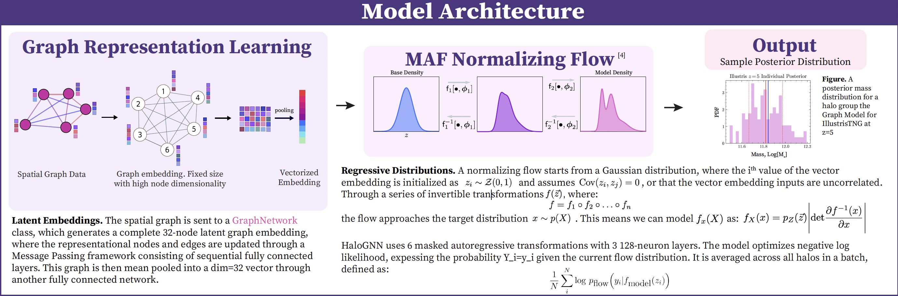

# HaloGNN

## Scripts

- 'fcn_data.py': This generates the data for the fully connected network, which takes in summary statistics of a halo.
- 'fcn_model.py': This is the FCN model. More detailed documentation on how it works is available in the file itself or in the paper
- 'fcn.py': This loads the data, instantiates an FCN model, and trains.
- 'gnn_data.py': Also generates the data for the graph neural network. As represented above, it creates a point cloud summary as a proxy for the summary statistics vector.
- 'gnn_model.py': The GNN model. More detailed documentation available in the file and paper.
- 'gnn.py': Loads the data, instantiates a GNN model, and trains.
- 'helpers.py': Contains functions for pre, mid, and post training. Pre-training: loading, processing, and standardizing data. Mid-training: creates dataloaders, loads models. Post-training: generating and unstandardizing predictions.
Handles data, provides functions to handle standardization, used features, managing dataloaders, models, and post-training.
- 'utils.py': Provides some essential data loading, pre-processing, and path management functions. Does not need to be imported if helpers.py already is.

## Notebooks
- 'training_models.ipynb': Walks you through a model training session. Make sure to budget requisite time and memory.
- 'coverage_levels.ipynb': Walks you through generating the coverage plots shown in the paper. Requires a pretrained model.
- 'data_comparison.ipynb': Highlights some differences between the Illustris and Astrid catalogues.
- 'figs.ipynb': Walks you through generating some of the notable figures for the paper. (Notably, the halo mass function)